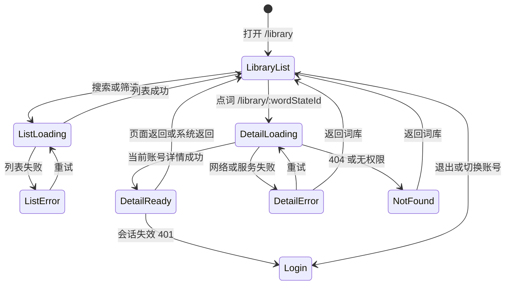

# 拾词 Phase 3 手机端工作流设计

> 状态：待评审。2026-09-24 基于 `c1fd11e` 的只读核对。本文件是设计决策，不表示 Phase 3 已实现或通过验收。

## 1. 目标与边界

手机在 ≤900px 下可从词库列表进入某个词的完整详情，查看音标、完整中文释义、复习历史与文章暴露；返回后保留筛选和列表位置。桌面在 ≥901px 保留现有双栏交互。同步处理底栏安全区域、导入图片列表和阅读查词卡片的空间关系。PWA 在本文件只定义缓存边界与验收方法。

本轮不修改前后端代码、数据库、Service Worker 或正式实例。后续 Phase 3 实现仍不得修改后端或 schema，不引入离线写入和后台同步。

## 2. 现状核对与约束

| 位置 | 已核实事实 | 设计含义 |
|---|---|---|
| `frontend/src/pages/LibraryPage.tsx` | 列表行以 `word_state_id` 为 key 和选中值；详情已请求 `GET /api/words/state/{selected}`；搜索、状态、视图和选中值只在组件 state 中 | 路由可直接使用 `word_state_id`，但进入新路由会卸载列表，需显式保存筛选与滚动 |
| `backend/app/api/words.py` | `/state/{state_id}` 加载当前用户的 `user_word_state`，含 `review_history`、`article_exposures`；旧 `/{word_id}` 仅接受旧 `word.id` | 新 URL 定为 `/library/:wordStateId`；不得把旧 `id` 或 `added_word_id` 当成路由 ID；404 不能显示其他用户数据 |
| `frontend/src/App.tsx` | 目前只有 `/library`；认证门禁按 `user.id` 重建子树 | 增加详情路由即可复用门禁；账号切换时也须丢弃列表恢复状态 |
| `frontend/src/styles.css` | ≤900px 同时隐藏 `.word-detail` 和 `.image-list`；≤620px 六项导航固定在 64px 底栏，退出按钮仍在侧栏布局内；无 safe-area 适配 | 需用断点分离手机详情与桌面双栏，并重排手机底栏 |
| `frontend/src/pages/ImportPage.tsx` | 上传前文件队列可见，上传后的图片在 `.image-list`；候选编辑表格最小宽度 980px | 手机必须看见已保存图片；候选校对仍按电脑管理终端定位，须显示明确提示 |
| `frontend/src/pages/ReadingPage.tsx` | `.lookup-card` 是阅读页浮层；≤720px `bottom:78px`、`max-height:58vh`；`added_word_id` 来自旧 `legacy_word_id`，新加入文章的词可为 null | 不用查词响应中的 `added_word_id` 拼详情 URL；详情页与查词浮层不同时呈现 |
| 现有测试 | `App.test.tsx` 测路由壳，`auth.test.tsx` 测切号不见旧内容，`ImportPage.test.tsx` 测导入，`ReadingPage.test.tsx` 测查词；缺词库手机详情和断点测试 | 实现时新增专门的路由、状态恢复、布局和缓存验收 |

产品约束见 `PROJECT_ARCHITECTURE.md` §2.2：手机负责学习和阅读，电脑负责导入与校对等重操作；完整原书释义始终可从 anchor 返回。路线图 §6.2 的出口是手机四类详情信息可达、底栏不遮挡、PWA 可安装、API 不被 SW 缓存且切号无残留。

## 3. 方案取舍

| 方案 | 适用性 | 代价 |
|---|---|---|
| 详情抽屉 | 列表上下文仍在，关闭快 | 长释义、原文及历史要在局部滚动；需处理焦点、遮罩与底栏 |
| 贴底卡片 | 与阅读查词形态接近 | 可用高度最少，长内容和底栏易冲突；与现有查词卡片容易形成两套相似浮层 |
| **独立路由（采用）** | 全屏纵向阅读，系统返回键、刷新和直接打开 URL 都有清晰语义 | 需显式保存列表筛选、滚动与焦点 |

详情路由只读调用现有 API，不新增端点。手机使用整页内容区；桌面仍在 `/library` 的双栏中点选词。桌面直接打开 `/library/:wordStateId` 时也可显示可用详情页和返回词库入口，避免深链空白；这不改变桌面列表的默认双栏行为。

## 4. 页面状态与交互

### 4.1 列表进入与返回

- ≤900px 的词条行表现为可进入详情的链接，触控目标不小于 44×44 CSS px；点选后 URL 为 `/library/{word_state_id}`。≥901px 行仍是选中双栏详情，不改变地址。
- 搜索词、状态与视图写入 `/library` 的查询参数，作为列表状态的唯一可分享来源；无值时省略。所有参数经白名单解析，无效视图回退“全部”。快速输入继续使用当前延迟查询行为。
- 进入详情前，在当前账号的内存状态中记录列表 history entry key、滚动容器位置和被点词的 `word_state_id`。详情页“返回词库”和浏览器/Android 返回都回到该列表 entry。列表数据加载并完成布局后恢复滚动位置及焦点；若词条因筛选或数据变化已不存在，则恢复近似滚动位置并将焦点放在列表标题。不要把词条正文或恢复快照写入 localStorage、sessionStorage 或 Cache Storage。
- 直接打开详情 URL、刷新或从非词库入口进入时，没有可恢复的列表 entry；“返回词库”去 `/library`。登出、401、改密和切号时清除内存恢复状态；新账号不得沿用旧账号的筛选或位置。当前 URL 若仍指向旧账号的 state ID，由新账号 API 授权结果决定，404 显示无权限/不存在的统一空态。

### 4.2 详情内容

页首有“返回词库”、词形、音标、词性和学习状态。正文顺序为：anchor 与语义笔记；“原书完整释义”（`MeaningList(source_meanings, source_raw)`，直接展开且不得截断）；可展开的原始文本 `source_raw`（若已作为唯一释义回退，避免重复朗读）；成功/失败/阅读暴露计数；逐条复习历史（时间、结果、状态迁移、来源）；逐条文章暴露（上下文及现有 API 的次数/时间）；疑点提示。长音标、长中文行和原始文本换行，不产生页面横向滚动。没有记录时显示明确空态，不以“0”替代完整历史。

详情请求以 `word_state_id` 作 query key，仅在合法正整数时触发。首次进入显示标题占位与加载状态；网络失败保留页首返回入口，提供“重试”；404 显示统一“不存在或无法访问”；401 交给现有认证门禁回登录。切换词条或账号时不得短暂呈现上一个词的详情。离线时不展示曾缓存的私有详情作为“可用”。

## 5. 底栏、导入与查词避让

- ≤620px 采用五项底栏：概览、学习、阅读、词库、更多。“更多”是可关闭菜单，放导入、设置、帮助与退出；不得让退出按钮继续挤在固定导航高度内。621–900px 保留窄侧栏，但详情仍走独立路由。底栏每项有可读标签、选中态与不小于 44px 的操作区域；详情路由时“词库”为当前项。
- `viewport-fit=cover` 后，底栏背景覆盖底部安全区域，交互内容上移 `env(safe-area-inset-bottom)`；主内容末尾预留底栏总高加 safe-area。顶部和横屏侧边也核对安全区域，键盘弹出时不让固定导航盖住输入框。仍需在无 safe-area 的 Android 上保持正确高度。
- ≤900px 显示已保存图片列表，按图片显示名称、尺寸、OCR 状态和移除操作，并保留“继续添加照片”入口；文件名换行而非撑宽页面，危险移除给清晰确认。候选编辑表格的 980px 宽屏形态不作为手机完成校对的交付，手机在进入候选阶段显示“请在电脑上完成逐项校对和确认入库”的明确提示及候选数量；不得在手机上让误触的确认按钮绕过人工校对。
- 查词卡片只在阅读页存在；进入词库详情时阅读页卸载并关闭卡片，不叠加两个详情层。现阶段不从 `added_word_id` 直接跳词库详情。≤620px 将查词卡片底边按底栏总高加 safe-area 计算，最大高度限制在剩余可视区；621–720px 侧栏不是底栏，查词卡片不应无故保留 78px 下边距。卡片自身可滚动，关闭按钮始终可触达，阅读正文不被永久遮住。

## 6. PWA 缓存设计与安全边界（本轮不实现）

后续 SW 对所有 `/api/**` 请求，包括 GET、POST、成功和错误响应，一律直接走网络且绝不调用 Cache Storage 写入；跨账号不可出现上一账号的词库、文章、导入、设置或复习数据。只允许白名单静态资源进入 SW 缓存：带 hash 的 `/assets/*`、公共图标与 manifest；`index.html` 采用网络优先，且 HTML 本身不得内嵌账号数据。禁止笼统缓存导航响应、任意同源 GET、含用户凭据/私有内容的响应。SW 不能可靠地从请求头读取浏览器附加的 Cookie，也不能依赖读取被浏览器屏蔽的 `Set-Cookie` 响应头，因此安全边界必须以**精确静态路径白名单**为主，而非“检测到 Cookie 才排除”。

前端 API 请求后续还应指定 `cache: 'no-store'`，避免浏览器 HTTP 缓存成为 SW 之外的私有数据来源；保留现有 `AuthProvider` 的 QueryClient 清空、generation 防旧请求回填及 `Gate key={user.id}`，并覆盖新详情和列表恢复状态。SW 版本更新只清理本应用旧静态缓存；不缓存 API、不做离线复习写队列。断网时可显示公共 shell，但私有页必须显示需要联网的状态，不能回放上一账号内容。

## 7. 失败边界、回退与验收

本设计不能改善无网络时的私有数据读取，也不改变导入候选在手机上的宽屏校对限制。若手机详情发布后出现严重导航问题，可撤回新详情路由与手机入口，保留后端数据和桌面双栏；因为无 schema/后端变化，不需要数据库回滚。SW 单独发布、单独验收，失败时停止注册并清理其静态缓存，不用离线私有缓存作兜底。

### 7.1 实现阶段自动化测试

1. 新增词库路由测试：传统词及文章加入词均使用 `word_state_id` 请求 `/api/words/state/{id}`；不误用旧 `id`。覆盖四类内容、空历史、长释义、加载/重试/404/401、非法路由参数、直达刷新。
2. 覆盖输入搜索词、状态和视图后进入详情，再用页内与浏览器返回，确认 URL 参数、列表滚动和焦点恢复；账号切换或会话失效后恢复状态清空。
3. 断点交互与视觉检查：320、375、390、430、620、621、720、900、901px；重点覆盖侧栏/底栏切换、safe-area、查词卡片、已保存图片列表及候选提示；≥901px 双栏无回归。
4. 保留 `App.test.tsx`、`auth.test.tsx`、`ImportPage.test.tsx`、`ReadingPage.test.tsx` 既有语义，增加对应断言。SW 实现时用受控 fetch 与 Cache Storage 测试所有 `/api/**` 方法和状态均零缓存；A 登出/B 登录、刷新、离线和旧请求迟到均无 A 内容。最后跑 `scripts/check.ps1` 全门禁。

### 7.2 Android / iOS 人工验收

只在隔离测试环境进行，不用本机正式实例。准备两个不同私有词和文章的测试账号、一个含长释义与复习/暴露记录的词、一个文章加入且无旧 `word.id` 的词、一个含多张图片的未完成导入批次。

- **Android Chrome**：在常见窄屏与横屏打开词库，搜索/筛选→向下滚动→进详情→检查四类资料→系统返回，核对筛选与位置；再测直达 URL、刷新、无网/恢复网络、图片列表和阅读查词卡片。PWA 实现后添加到主屏，核对图标、主题色和 standalone 启动。
- **iOS Safari**：同样走词库、阅读和导入路径；在带 Home Indicator 的设备与主屏模式检查底栏/查词卡片/详情末尾不被遮挡，覆盖横屏、安全区域、软键盘与 Safari 返回手势。PWA 实现后验证“添加到主屏幕”、图标、状态栏及 standalone。
- **账号隔离**：A 打开详情和文章后退出，B 登录并尝试浏览器返回、直达旧 URL、断网、重新联网；任何步骤都不显示 A 的词或文章。检查 Cache Storage 所有 cache 的 URL 和内容，无 `/api/**` 条目或私有数据。PWA 未实现前该项只能作为未来验收标准，不能宣称通过。

## 8. 拟修改文件（后续实现，不在本提交中）

| 文件 | 预计变更 |
|---|---|
| `frontend/src/App.tsx` | 增加 `/library/:wordStateId` 路由 |
| `frontend/src/pages/LibraryPage.tsx`、拟新建详情组件 | 列表状态 URL 化、手机进入/返回、共享详情呈现 |
| `frontend/src/components/AppShell.tsx` | 手机五项底栏与“更多”，保持桌面导航 |
| `frontend/src/styles.css`、`frontend/index.html` | 断点、safe-area、底栏/查词避让、viewport |
| `frontend/src/pages/ImportPage.tsx` | 已保存图片列表与手机候选提示 |
| `frontend/src/api.ts`、`frontend/src/auth.tsx` | API HTTP 缓存边界及切号恢复状态清理（实现时核对现有语义） |
| `frontend/src/**/*.test.tsx` | 新路由、状态恢复、账号隔离和响应式交互测试 |
| 未来独立 PWA 实现文件 | manifest、图标、SW、注册及 SW 缓存测试；本设计提交不创建它们 |

本设计文档的评审通过，只意味着可以进入实现计划；不代表 Phase 3 完成。
